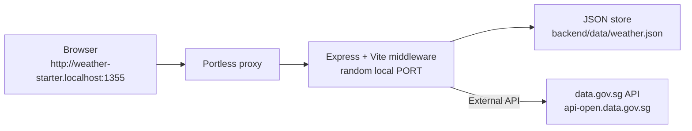

# Weather Starter

A minimal TypeScript weather app starter project for agentic coding.

The app tracks Singapore locations and stores the latest weather snapshot for each one. It uses a Node/Express backend, a React/Vite frontend, and Portless so each git worktree gets its own stable `.localhost` URL without hard-coded port juggling.

## Tech Stack

| Layer | Tools |
| --- | --- |
| Backend | Node.js, TypeScript, Express |
| Frontend | React 18, Vite, Tailwind CSS |
| Dev URL | Portless named `.localhost` URLs |
| External API | Singapore data.gov.sg (`api-open.data.gov.sg`) |
| Storage | Local JSON file at `backend/data/weather.json` |

## Architecture



The backend and frontend run as one Node process in development. Express serves `/api/*`, and Vite middleware serves the React app. The frontend uses relative `/api` requests, so there is no frontend/backend port configuration.

In a linked git worktree, Portless prepends the branch name as a subdomain. For example, branch `map-view` gets a URL like:

```text
http://map-view.weather-starter.localhost:1355
```

## Quick Start

Requirements:

- Node.js 20+

Install dependencies:

```bash
npm install
```

Start the app:

```bash
npm run dev
```

This project runs Portless on an unprivileged local proxy port by default, so no sudo or certificate trust prompt is required. After startup, open the URL printed by Portless, normally:

```text
http://weather-starter.localhost:1355
```

Verify the app:

```bash
WEATHER_STARTER_URL=http://weather-starter.localhost:1355 npm run doctor
```

Reset local app data:

```bash
npm run reset
```

## Useful Commands

```bash
npm run dev      # Start Express + Vite through Portless
npm run build    # Build frontend and compile backend TypeScript
npm run start    # Run the compiled production server
npm run doctor   # Verify /health and /api/locations
npm run reset    # Remove local JSON data
```

## API

| Method | Endpoint | Description |
| --- | --- | --- |
| `GET` | `/health` | Health check |
| `GET` | `/api/locations` | List all locations |
| `POST` | `/api/locations` | Create a location |
| `GET` | `/api/locations/:id` | Get a single location |
| `POST` | `/api/locations/:id/refresh` | Refresh weather for a location |

Create a location:

```bash
curl -s -X POST http://weather-starter.localhost:1355/api/locations \
  -H "Content-Type: application/json" \
  -d '{"latitude": 1.35, "longitude": 103.85}'
```

Refresh weather:

```bash
curl -s -X POST http://weather-starter.localhost:1355/api/locations/1/refresh
```

## Data Flow

The app does not call the external weather API on every page load. It uses a snapshot pattern:

1. Creating a location saves coordinates locally with a placeholder weather status.
2. Listing locations reads from `backend/data/weather.json`.
3. Refreshing weather calls data.gov.sg, writes the latest snapshot back to the local store, and returns the updated location.

## Project Structure

```text
weather-starter/
├── backend/
│   ├── package.json
│   ├── tsconfig.json
│   └── src/
│       ├── server.ts                  # Express app + Vite middleware
│       ├── db.ts                      # Local JSON store
│       ├── weather.ts                 # Singapore weather API client
│       └── routes/
│           └── locations.ts           # Location endpoints
├── frontend/
│   ├── index.html
│   ├── package.json
│   ├── postcss.config.js
│   ├── tailwind.config.js
│   ├── vite.config.js
│   └── src/
│       ├── main.jsx
│       ├── App.jsx
│       ├── api/
│       ├── hooks/
│       ├── components/
│       └── pages/
├── scripts/
│   ├── dev.mjs
│   ├── start.mjs
│   ├── doctor.mjs
│   └── reset.mjs
├── package.json
└── package-lock.json
```

## External API Reference

All endpoints are on `https://api-open.data.gov.sg`. No API key is required for basic usage, but you may hit rate limits during heavy development.

| Endpoint | Docs | Notes |
| --- | --- | --- |
| `GET /v2/real-time/api/two-hr-forecast` | [2-hour Forecast](https://data.gov.sg/datasets/d_3f9e064e25005b0e42969944ccaf2e7a/view) | Used by this app. Response includes `area_metadata` and area forecasts. |
| `GET /v2/real-time/api/air-temperature` | [Realtime Weather Readings](https://data.gov.sg/collections/realtime-weather-readings/view) | Temperature in Celsius from weather stations. |
| `GET /v2/real-time/api/relative-humidity` | [Realtime Weather Readings](https://data.gov.sg/collections/realtime-weather-readings/view) | Humidity percentage from weather stations. |
| `GET /v2/real-time/api/rainfall` | [Realtime Weather Readings](https://data.gov.sg/collections/realtime-weather-readings/view) | Rainfall in mm from weather stations. |

Optional API key:

```bash
export WEATHER_API_KEY=your_api_key_here
npm run dev
```

## Feature Tasks

These tasks are ordered from easiest to hardest.

### 1. Delete a location

Add a `DELETE /api/locations/:id` endpoint and a delete button to each card in `LocationList.jsx`.

| Layer | What to do |
| --- | --- |
| Backend | New DELETE endpoint in `backend/src/routes/locations.ts` |
| Frontend | Delete button in `frontend/src/components/LocationList.jsx` |

### 2. Geolocation + auto-detect

Add a "Use my location" button that detects the user's position, finds the nearest Singapore forecast area, and adds it automatically. If you need browser geolocation in development, run Portless with HTTPS enabled by setting `PORTLESS_HTTPS=1` and using the trusted HTTPS URL.

| Layer | What to do |
| --- | --- |
| Backend | No changes needed; nearest-area matching already exists in `backend/src/weather.ts` |
| Frontend | New button in `LocationForm.jsx` using the Geolocation API. Auto-refresh after add. |

### 3. Singapore area picker

Replace manual lat/lon inputs with a searchable dropdown. The 2-hour forecast response includes `area_metadata` with area names and coordinates.

| Layer | What to do |
| --- | --- |
| Backend | Add an endpoint that exposes forecast areas from the weather API |
| Frontend | Replace lat/lon fields with a searchable select/autocomplete |

### 4. Current conditions detail

Show temperature, humidity, and rainfall alongside the forecast condition.

| Layer | What to do |
| --- | --- |
| Backend | Add service calls for the relevant data.gov.sg realtime reading endpoints |
| Frontend | Display additional readings on each location card |
