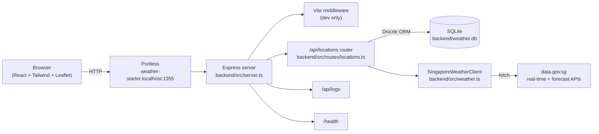
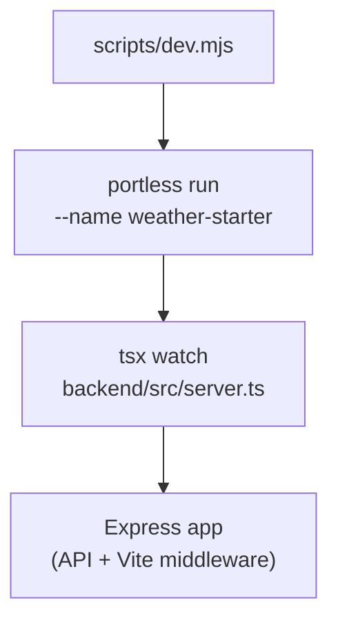
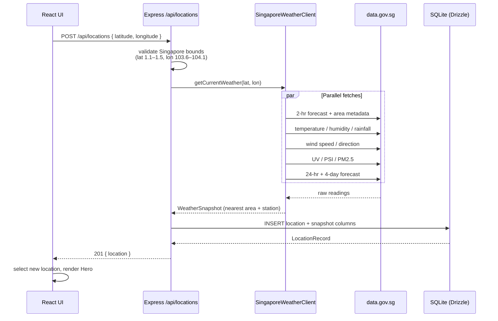
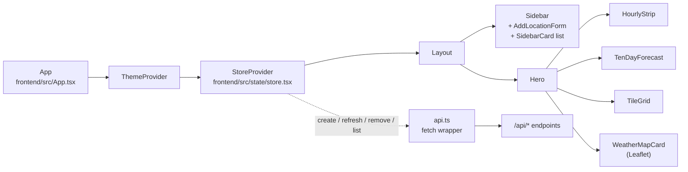

Weather Starter is a single-process Node.js app. Express serves the REST API; Vite is mounted as middleware in development so React assets stream from the same origin. SQLite (via Drizzle) is the system of record for locations and the most recent weather snapshot per location. Live data comes from Singapore's public data.gov.sg APIs.

## System overview

In production, Vite is replaced by static asset serving from the frontend build output, and Portless is bypassed in favor of `PORT`.

## Process model

The dev server is a single Node process driven by `scripts/dev.mjs`:

`tsx watch` reloads the server on any file change under `backend/src/`. Vite handles HMR for the frontend independently.

## Adding a location

Adding a location triggers an immediate fetch from data.gov.sg. The response is normalized and stored as a snapshot alongside the location row.

## Refreshing weather

`POST /api/locations/:id/refresh` re-runs the same client and updates the existing row's snapshot columns — no new row is created.

## Frontend composition

The UI is a two-pane layout. State lives in a single React Context (`useStore`) that owns the location list, the selected ID, and pending operations.

On mount, `StoreProvider` calls `listLocations()` and auto-selects the first one if no selection exists.

## External dependencies

- `https://api-open.data.gov.sg/v2/real-time/api/...` — modern v2 endpoints for forecasts, temperature, humidity, rainfall, wind, UV, PSI, and PM2.5.
- `https://api.data.gov.sg/v1/environment/4-day-weather-forecast` — legacy v1 endpoint for the 4-day outlook.

Set `WEATHER_API_KEY` to authenticate requests against tighter rate limits.
