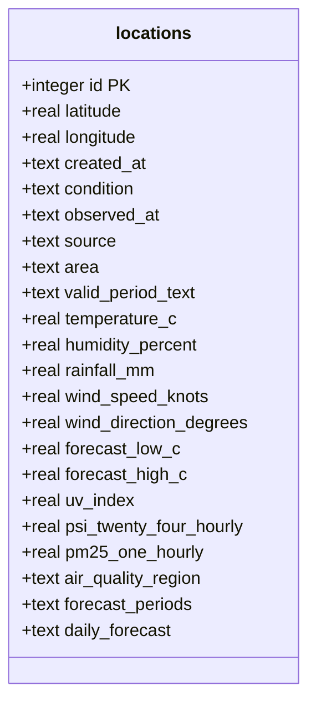

The database is a single SQLite file (`backend/weather.db` by default, override with `DATABASE_PATH`). Schema lives in [`backend/src/schema.ts`](https://github.com/) and migrations are emitted to `backend/drizzle/`.

## `locations`

One row per stored location. Snapshot columns are updated in place on every refresh — there is no historical weather table.



### Columns

| Column | Type | Notes |
| --- | --- | --- |
| `id` | integer | Primary key, autoincrement |
| `latitude` | real | Required. Composite unique with `longitude` |
| `longitude` | real | Required |
| `created_at` | text | ISO timestamp |
| `condition` | text | Nullable. e.g. "Partly Cloudy" |
| `observed_at` | text | Nullable. ISO timestamp from data.gov.sg |
| `source` | text | Nullable. Source label ("data.gov.sg", etc.) |
| `area` | text | Nullable. Nearest forecast area name |
| `valid_period_text` | text | Nullable. Human-readable forecast validity window |
| `temperature_c` | real | Nullable |
| `humidity_percent` | real | Nullable |
| `rainfall_mm` | real | Nullable |
| `wind_speed_knots` | real | Nullable |
| `wind_direction_degrees` | real | Nullable |
| `forecast_low_c` | real | Nullable. From 24-hr forecast |
| `forecast_high_c` | real | Nullable |
| `uv_index` | real | Nullable |
| `psi_twenty_four_hourly` | real | Nullable |
| `pm25_one_hourly` | real | Nullable |
| `air_quality_region` | text | Nullable. Nearest air-quality region |
| `forecast_periods` | text | JSON array of `ForecastPeriod` (defaults to `[]`) |
| `daily_forecast` | text | JSON array of `DailyForecast` (defaults to `[]`) |

### Indexes

- Composite `UNIQUE(latitude, longitude)` — prevents duplicate locations.

## Migrations

Generate after editing `schema.ts`:

```bash
npm run db:generate
```

Apply pending migrations (also runs on backend startup):

```bash
npm run db:migrate
```

Reset the database entirely:

```bash
npm run reset
```
